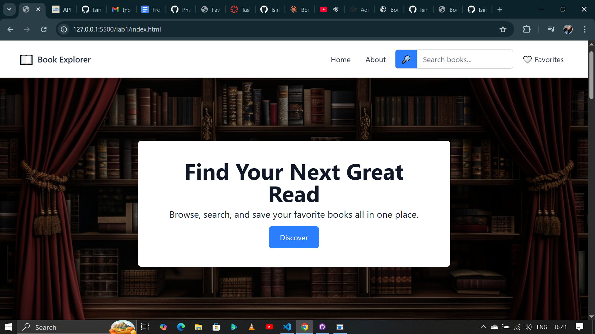

**Book Explorer**

Book Explorer is a web application that allows users to search for books using the Open Library API, view book details, and save their favorite books. Favorites persist in the browser using LocalStorage. The app is responsive and works on both desktop and mobile devices.

**Features**

Search books by title, author, or description.

View book details (title, author, cover image, description).

Add or remove books from favorites.

Favorites are saved in LocalStorage.

Responsive design for mobile and desktop.

Navbar scroll effect and feedback/loading states while fetching books.

**Project Setup**

Clone the repository

git clone https://github.com/yourusername/book-explorer.git

Navigate into the project folder

cd book-explorer

**Open the app in a browser**

You can directly open index.html or favorite.html in your browser.
Optionally, use a live server (like VS Code Live Server) for faster development and auto-refresh.

**Folder Structure**

index.html, favorite.html, about.html — Main pages of the app.

assets/js/ — All JavaScript files:

main.js — Handles fetching books, rendering cards, and search functionality.

fetchApi.js — Contains the API fetch function.

favorites.js — Manages adding/removing books from favorites using LocalStorage.

index.js — Handles navbar scroll effects.

favoritePage.js — Handles rendering favorites page.

assets/images/ — Images used in the app:

### Homepage

### About Page

### Favorites Page

**Technologies Used**

HTML, CSS, JavaScript

Tailwind CSS

Open Library API

LocalStorage